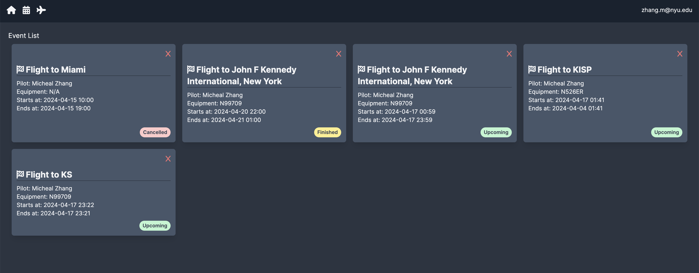
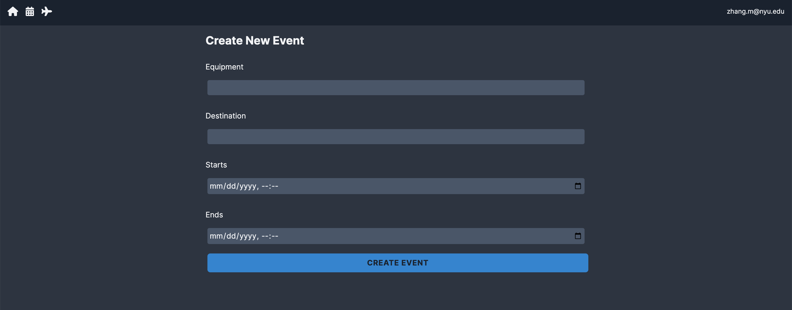
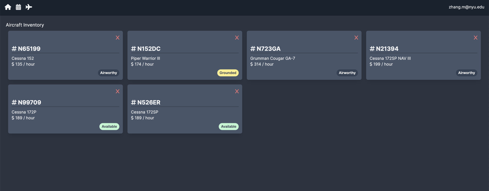
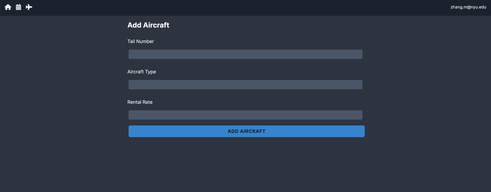
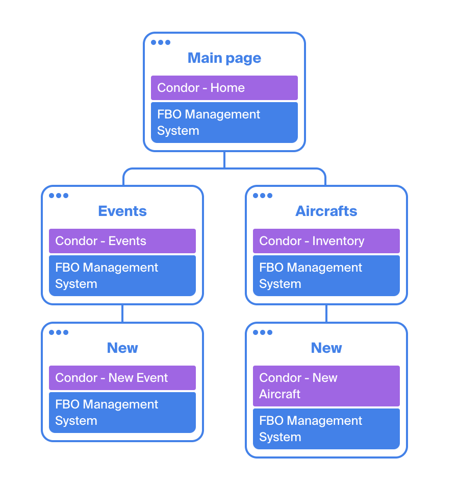

# Condor

## Overview

The traditional way of renting an aircraft involves calling FBOs to check availabilities and make reservations. This is a time-consuming process and can become difficult to keep track of for both pilots and FBOs once the number of reservations increases.

Condor is a web app designed to solve this issue. Pilots can create, view, check-in, or cancel upcoming events.


## Data Model

The application will store Events and Planes

An Example Event:

```javascript
{
  user: "New Pilot",
  equipment: // a reference to a Plane,
  starts: // timestamp,
  ends: // timestamp,
  status: // enum{created|checked-in|cancelled},
}
```

An Example Plane:

```javascript
{
  tailNumber: "N12345",
  model: "Cessna 172SP"
  rate: 200,
  status: // enum{available|grounded},
}
```


## [Link to Schema](app/(models)/db.mjs) 


## Wireframes

/events - page for showing all upcoming events



/events/new - page for making an aircraft reservation



/aircrafts - page to view and manage all aircraft



/aircrafts/new - page to add an aircraft into the inventory




## Site map




## User Stories or Use Cases

1. as a user, I can create a new event
2. as a user, I can view all of the upcoming
3. as a user, I can cancel an upcoming event
4. as a user, I can add an aircraft
5. as a user, I can view information on all aircrafts


## Research Topics

* (6 points) Use Next JS with React as the front-end framework
* (2 points) Use Tailwind CSS to create consistent website styling and layouts
* (2 points) Additional JavaScript library:
    * Font Awesome: to conveniently import icons
        * https://docs.fontawesome.com/web/use-with/react/
    * Day.JS
* (1 point) External APIs:
    * Airport Database API
        * https://airportdb.io/

11 points total out of 10 required points


## Annotations / References Used

Tailwind CSS code references:

https://github.com/ClarityCoders/Ticket-Tutorial-App

